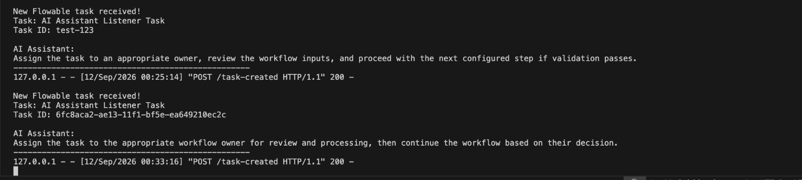

# Flowable v6 AI Assistant Integration PoC

## 1. Objective

Build a minimal proof of concept demonstrating the feasibility of integrating an AI assistant with Flowable Open Source v6.

The PoC demonstrates two approaches for integrating AI with Flowable:

1. REST API polling
2. Native Flowable task-created event listener

The event-driven implementation automatically detects newly created Flowable tasks and sends task information to an external AI integration service.

---

## 2. Environment

- **Flowable Open Source:** v6.8.0
- **Deployment:** Docker
- **Database:** H2 (default)
- **Python:** 3.13
- **Integration:** Python
- **Flowable Interface:** REST API
- **AI Integration:** OpenAI API
- **Operating System:** macOS
- **Container Architecture:** Linux AMD64 image running through Docker emulation on Apple Silicon

---

## 3. Architecture

The PoC demonstrates two AI integration approaches.

### 3.1 REST API Polling Approach

```text
                 ┌─────────────────────┐
                 │     Flowable v6     │
                 │    BPMN Workflow    │
                 └──────────┬──────────┘
                            │
                            │ REST API
                            ▼
                 ┌─────────────────────┐
                 │ Integration Service │
                 │      Python         │
                 └──────────┬──────────┘
                            │
                            │ New task detected
                            ▼
                 ┌─────────────────────┐
                 │     OpenAI API      │
                 │    AI Assistant     │
                 └──────────┬──────────┘
                            │
                            │ AI recommendation
                            ▼
                 ┌─────────────────────┐
                 │   Terminal Output   │
                 └─────────────────────┘
```

The polling implementation checks the Flowable REST API every 5 seconds for newly created tasks.

### 3.2 Event-Driven Approach

```text
                 ┌─────────────────────┐
                 │     Flowable v6     │
                 │    BPMN Workflow    │
                 └──────────┬──────────┘
                            │
                            │ Task created
                            ▼
                 ┌─────────────────────┐
                 │   Groovy Task       │
                 │      Listener       │
                 └──────────┬──────────┘
                            │
                            │ HTTP POST
                            ▼
                 ┌─────────────────────┐
                 │   Flask Webhook     │
                 │      Python         │
                 └──────────┬──────────┘
                            │
                            │ OpenAI API
                            ▼
                 ┌─────────────────────┐
                 │    AI Assistant     │
                 │   Recommendation    │
                 └─────────────────────┘
```

The event-driven implementation uses a native Flowable `create` task listener. When a user task is created, the listener sends the task information to the Flask webhook, which invokes the OpenAI API.

---

## 4. Flowable Local Setup

A local Flowable Open Source v6.8.0 instance was started using Docker Compose.

The Flowable REST API was exposed locally through:

```text
http://localhost:8080/flowable-rest/
```

The Flowable Swagger documentation was verified at:

```text
http://localhost:8080/flowable-rest/docs/
```

The local instance was successfully started and the REST API was accessible.

---

## 5. BPMN Process

A simple BPMN process was created for the initial polling-based PoC.

The process contains:

* Start Event
* User Task
* End Event

The user task is named:

```text
AI Assistant Demo Task
```

The process definition key is:

```text
aiDemoProcess
```

The BPMN process was deployed to the local Flowable instance through the REST API.

A second BPMN process was created for the event-driven implementation.

The event-driven process contains:

* Start Event
* User Task
* End Event
* Native Flowable task `create` listener attached to the user task

The event-driven process definition key is:

```text
aiListenerDemoProcess
```

---

## 6. Process Instance Creation

A process instance was created using the Flowable REST API.

Endpoint:

```text
POST /flowable-rest/service/runtime/process-instances
```

The process instance was successfully created and reached the user task.

---

## 7. Task Verification

The active Flowable tasks were retrieved using:

```text
GET /flowable-rest/service/runtime/tasks
```

The API returned the created task:

```text
Task: AI Assistant Demo Task
```

The response confirmed that the task was active and available through the Flowable REST API.

---

## 8. Python AI Integration

A Python integration script was developed to communicate with the Flowable REST API.

The integration retrieves active tasks using:

```text
GET /flowable-rest/service/runtime/tasks
```

The following task information is extracted:

* Task name
* Task ID
* Task priority
* Assignee

The extracted information is then passed to the OpenAI API.

---

## 9. AI Assistant Integration

The OpenAI Python SDK was used to connect the integration service to the OpenAI API.

The API key is provided through the environment variable:

```text
OPENAI_API_KEY
```

The API key is not stored directly in the Python source code.

The AI assistant receives Flowable task information and generates a short recommendation about the current task and suggested next step.

---

## 10. Automatic Task Detection

A separate Python integration service was implemented to continuously monitor Flowable.

The service polls the Flowable REST API every **5 seconds**.

It maintains a set of previously detected task IDs.

When a new task ID is detected, the service:

1. Detects the new Flowable task.
2. Extracts the task information.
3. Sends the information to the OpenAI API.
4. Receives an AI-generated recommendation.
5. Displays the recommendation in the terminal.
6. Records the task ID to avoid processing the same task again.

---

## 11. Automatic Detection Flow

### 11.1 REST Polling Flow

```text
New Flowable Process Instance
            |
            ▼
New User Task Created
            |
            ▼
Integration Service Polls REST API
            |
            ▼
New Task ID Detected
            |
            ▼
Task Information Extracted
            |
            ▼
OpenAI API Called
            |
            ▼
AI Recommendation Generated
            |
            ▼
Recommendation Displayed
```

### 11.2 Event-Driven Flow

```text
New Flowable Process Instance
            |
            ▼
New User Task Created
            |
            ▼
Flowable Task Listener Triggered
            |
            ▼
HTTP POST to Flask Webhook
            |
            ▼
Task Information Sent to OpenAI
            |
            ▼
AI Recommendation Generated
            |
            ▼
Recommendation Returned
```

---

## 12. Test Results

The polling-based integration service was started successfully:

```text
Flowable AI Integration Service started.
Waiting for new tasks...
```

The service automatically detected a Flowable task:

```text
New Flowable task detected!

Task: AI Assistant Demo Task
Task ID: 356843af-ae09-11f1-bf5e-ea649210ec2c
```

The AI assistant generated a recommendation:

```text
Assign the task to an appropriate owner, then review and complete
the required AI Assistant Demo steps.
```

This confirmed successful communication between Flowable, the Python integration service, and the OpenAI API.

---

## 13. Multiple Task Detection Test

A second Flowable process instance was created to verify automatic detection of newly created tasks.

The integration service automatically detected the new task:

```text
New Flowable task detected!

Task: AI Assistant Demo Task
Task ID: fcd003f6-ae0b-11f1-bf5e-ea649210ec2c
```

The AI assistant generated another recommendation:

```text
Assign the task to an appropriate owner and begin by reviewing
the workflow requirements and available inputs.
```

This confirmed that the polling-based integration service can detect multiple newly created Flowable tasks and invoke the AI assistant automatically.

---

## 14. Event-Driven Task Listener Implementation

A native Flowable task `create` listener was implemented using a Groovy script.

The listener is attached to the user task in:

```text
process-listener.bpmn20.xml
```

When a new task is created, the listener:

1. Receives the Flowable task information.
2. Constructs a JSON payload.
3. Sends an HTTP POST request to the Flask webhook.
4. Receives the webhook response.
5. Logs the response in the Flowable container.

The webhook endpoint is:

```text
http://host.docker.internal:5001/task-created
```

The Flask service receives the task information and sends it to the OpenAI API.

---

## 15. Event-Driven Integration Test

The event-driven implementation was tested by creating a new process instance using:

```text
POST /flowable-rest/service/runtime/process-instances
```

The Flowable process instance was successfully created:

```text
processDefinitionId: aiListenerDemoProcess:4:...
completed: false
```

The Flask integration service automatically received the newly created task:

```text
New Flowable task received!

Task: AI Assistant Listener Task
Task ID: 6fc8aca2-ae13-11f1-bf5e-ea649210ec2c
```

The AI assistant generated a recommendation:

```text
Assign the task to the appropriate workflow owner for review
and processing, then continue the workflow based on their decision.
```

The Flask service returned a successful HTTP response:

```text
POST /task-created HTTP/1.1" 200
```

This confirmed the complete event-driven integration:

```text
Flowable
    ↓
Task Created Event
    ↓
Groovy Task Listener
    ↓
HTTP POST
    ↓
Flask Webhook
    ↓
OpenAI API
    ↓
AI Recommendation
```

---

## 16. Evidence

### Screenshot 1 — Flowable Swagger UI


The screenshot shows the locally running Flowable v6 REST API and Swagger documentation.

**Purpose:**

* Verify that Flowable v6 is running locally.
* Verify that the Flowable REST API is accessible.

### Screenshot 2 — Automatic AI Integration


The screenshot shows the Python integration service:

* Starting successfully
* Waiting for new tasks
* Detecting a Flowable task
* Sending task information to the AI assistant
* Displaying an AI-generated recommendation
* Detecting a second Flowable task
* Generating another AI recommendation

**Purpose:**

Demonstrates the polling-based end-to-end integration:

```text
Flowable → REST API → Python Integration → OpenAI → AI Recommendation
```

### Screenshot 3 — Flowable Task-Created Event Listener



The screenshot shows the native Flowable task-created listener triggering the Python AI webhook automatically.

The listener sends the newly created task information to the Flask integration service, which calls the OpenAI API and returns an AI-generated recommendation.

The successful HTTP `200` response confirms that the webhook request was processed successfully.

**Purpose:**

* Verify that the native Flowable task `create` listener is triggered.
* Verify communication from the Flowable Docker container to the Python webhook.
* Verify that the AI assistant is invoked automatically after task creation.

**Event-driven flow:**

```text
Flowable Task Created
        ↓
Groovy Task Listener
        ↓
HTTP POST
        ↓
Flask Webhook
        ↓
OpenAI
        ↓
AI Recommendation
```

---

## 17. Files Created

The PoC contains the following main files:

```text
flowable-ai-poc/
|
├── screenshots/
│   ├── flowable-swagger.png
│   ├── ai-integration.png
│   └── flowable-event-listener.png
├── docker-compose.yml
├── process.bpmn20.xml
├── process-listener.bpmn20.xml
├── ai_assistant.py
├── integration_service.py
├── ai_webhook.py
├── requirements.txt
└── AI_ASSISTANT_POC.md
```

### File Description

| File                          | Purpose                                                                                          |
| ----------------------------- | -------------------------------------------------------------------------------------------------- |
| `docker-compose.yml`          | Runs the local Flowable v6.8.0 instance                                                          |
| `process.bpmn20.xml`          | Sample BPMN process used for the REST polling-based AI integration                               |
| `process-listener.bpmn20.xml` | BPMN process containing the native Flowable task-created listener                                |
| `ai_assistant.py`             | Basic Flowable REST + OpenAI integration                                                         |
| `integration_service.py`      | Continuously monitors Flowable tasks and generates AI recommendations for newly detected tasks   |
| `ai_webhook.py`               | Flask webhook that receives task-created events and calls the OpenAI API                         |
| `requirements.txt`            | Python dependencies required for the PoC                                                         |
| `screenshots/`                | PoC screenshots showing the Flowable setup, polling integration, and event-driven AI integration |
| `AI_ASSISTANT_POC.md`         | Complete PoC documentation, architecture, implementation details, test results, and evidence     |

---

## 18. Key Technical Components

### Flowable

Used as the workflow engine for:

* BPMN process execution
* Process instance creation
* User task creation
* Task listeners
* Task retrieval through the REST API

### Python

Used as the integration layer between Flowable and the AI service.

Python is used for both:

* REST API polling
* Flask webhook integration

### Flowable REST API

Used to:

* Deploy BPMN processes
* Create process instances
* Retrieve active workflow tasks

### Flowable Task Listener

A native Flowable `create` task listener is used to detect task creation events and trigger the AI webhook.

### Flask

Used to expose the `/task-created` webhook endpoint that receives task information from the Flowable listener.

### Groovy

Used within the Flowable task listener to construct the task payload and send it to the Python webhook.

### OpenAI API

Used to analyze Flowable task information and generate AI-based recommendations.

### Docker

Used to run the local Flowable v6.8.0 environment.

---

## 19. Current PoC Approach

The PoC implements two approaches for integrating AI with Flowable.

### Approach 1 — REST API Polling

The initial implementation uses the Flowable REST API to retrieve active tasks.

The Python integration service checks for new tasks every 5 seconds and maintains a set of previously detected task IDs.

When a new task is detected, the task information is sent to the OpenAI API and an AI-generated recommendation is displayed.

This approach:

* Requires no modification to the Flowable engine
* Uses the available Flowable REST API
* Is simple to reproduce
* Demonstrates the AI integration end-to-end

### Approach 2 — Native Task-Created Event Listener

A second implementation uses Flowable's native `create` task listener.

When a new user task is created:

```text
Flowable Task Creation
        ↓
Groovy Task Listener
        ↓
HTTP POST
        ↓
Flask Webhook
        ↓
OpenAI API
        ↓
AI Recommendation
```

This event-driven approach avoids continuous REST polling and provides a direct mechanism for triggering the AI integration.

The event-driven implementation was successfully tested with Flowable v6.8.0 and a local Flask webhook.

### PoC Recommendation

For a production implementation, the event-driven approach is preferred where appropriate because it avoids unnecessary polling.

Production deployments should additionally consider asynchronous processing, retries, timeouts, authentication, monitoring, and failure handling.

---

## 20. Potential AI Use Cases

The demonstrated integration can be extended to support:

* Natural-language workflow queries
* Task prioritization
* Task recommendations
* Overdue task assistance
* Process and task summarization
* Workflow status explanations
* Task assignment recommendations
* Historical workflow analysis

---

## 21. Production Considerations

Before using the integration in production, the following areas should be addressed:

* Authentication and authorization
* Role-based access control
* Data privacy
* Secure API key management
* API error handling
* Retry and timeout handling
* Audit logging
* Rate limiting
* AI response validation
* Controlled workflow actions
* Monitoring and logging
* Asynchronous or event-driven processing where appropriate

The current event-driven listener performs the webhook call synchronously during task creation. For production use, asynchronous processing or a messaging/event mechanism should be considered so that temporary AI service failures do not unnecessarily block workflow execution.

AI-generated recommendations should be treated as assistance rather than automatically trusted workflow actions unless appropriate validation and authorization controls are implemented.

---

## 22. Conclusion

The PoC successfully demonstrates the feasibility of integrating an external AI assistant with Flowable Open Source v6 through its REST API and native task listeners.

The implementation successfully:

* Started a local Flowable v6.8.0 instance.
* Deployed BPMN processes.
* Created Flowable process instances.
* Created and retrieved user tasks.
* Built a Python integration service.
* Implemented REST API polling for automatic task detection.
* Implemented a native Flowable task-created listener.
* Connected the Flowable listener to a Flask webhook.
* Connected task information to the OpenAI API.
* Generated AI-based recommendations.
* Successfully tested multiple Flowable tasks.
* Verified successful HTTP communication between Flowable and the AI integration service.

The PoC demonstrates that AI capabilities can be integrated externally with Flowable OSS v6 without requiring the AI functionality to be part of the Flowable engine itself.

For production use, the event-driven approach can be preferred over continuous polling where appropriate, with additional controls for authentication, authorization, retries, timeouts, monitoring, audit logging, asynchronous processing, and AI response validation.