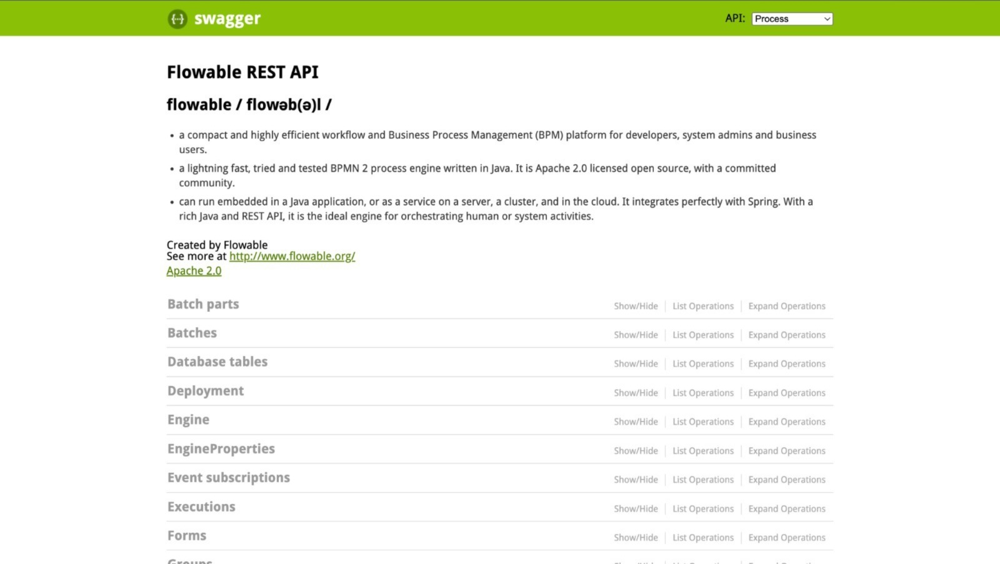
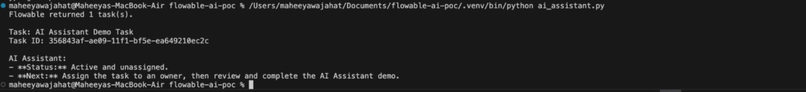

# Flowable v6 AI Assistant Integration PoC

## 1. Objective

Build a minimal proof of concept demonstrating the feasibility of integrating an AI assistant with Flowable Open Source v6.

The PoC demonstrates automatic detection of newly created Flowable tasks and generation of an AI-based recommendation.


## 2. Environment

- **Flowable Open Source:** v6.8.0
- **Deployment:** Docker
- **Database:** H2 (default)
- **Python:** 3.13
- **Integration:** Python
- **Flowable Interface:** REST API
- **AI Integration:** OpenAI API
- **Operating System:** macOS
- **Container Architecture:** Linux AMD64 image running through Docker emulation on Apple Silicon


## 3. Architecture

```text
                 ┌─────────────────────┐
                 │     Flowable v6     │
                 │    BPMN Workflow    │
                 └──────────┬──────────┘
                            │
                            │ REST API
                            ▼
                 ┌─────────────────────┐
                 │ Integration Service │
                 │      Python         │
                 └──────────┬──────────┘
                            │
                            │ Detects new task
                            │ every 5 seconds
                            ▼
                 ┌─────────────────────┐
                 │     OpenAI API      │
                 │    AI Assistant     │
                 └──────────┬──────────┘
                            │
                            │ AI-generated
                            │ recommendation
                            ▼
                 ┌─────────────────────┐
                 │   Terminal Output   │
                 └─────────────────────┘
```


## 4. Flowable Local Setup

A local Flowable Open Source v6.8.0 instance was started using Docker Compose.

The Flowable REST API was exposed locally through:

```text
http://localhost:8080/flowable-rest/
```

The Flowable Swagger documentation was verified at:

```text
http://localhost:8080/flowable-rest/docs/
```

The local instance was successfully started and the REST API was accessible.


## 5. BPMN Process

A simple BPMN process was created for the PoC.

The process contains:

* Start Event
* User Task
* End Event

The user task is named:

```text
AI Assistant Demo Task
```

The process definition key is:

```text
aiDemoProcess
```

The BPMN process was deployed to the local Flowable instance through the REST API.


## 6. Process Instance Creation

A process instance was created using the Flowable REST API.

Endpoint:

```text
POST /flowable-rest/service/runtime/process-instances
```

The process instance was successfully created and reached the user task.


## 7. Task Verification

The active Flowable tasks were retrieved using:

```text
GET /flowable-rest/service/runtime/tasks
```

The API returned the created task:

```text
Task: AI Assistant Demo Task
```

The response confirmed that the task was active and available through the Flowable REST API.


## 8. Python AI Integration

A Python integration script was developed to communicate with the Flowable REST API.

The integration retrieves active tasks using:

```text
GET /flowable-rest/service/runtime/tasks
```

The following task information is extracted:

* Task name
* Task ID
* Task priority
* Assignee

The extracted information is then passed to the OpenAI API.


## 9. AI Assistant Integration

The OpenAI Python SDK was used to connect the integration service to the OpenAI API.

The API key is provided through the environment variable:

```text
OPENAI_API_KEY
```

The API key is not stored directly in the Python source code.

The AI assistant receives the Flowable task information and generates a short recommendation about the current task and suggested next step.


## 10. Automatic Task Detection

A separate Python integration service was implemented to continuously monitor Flowable.

The service polls the Flowable REST API every **5 seconds**.

It maintains a set of previously detected task IDs.

When a new task ID is detected, the service:

1. Detects the new Flowable task.
2. Extracts the task information.
3. Sends the information to the OpenAI API.
4. Receives an AI-generated recommendation.
5. Displays the recommendation in the terminal.
6. Records the task ID to avoid processing the same task again.


## 11. Automatic Detection Flow

```text
New Flowable Process Instance
            |
            ▼
New User Task Created
            |
            ▼
Integration Service Polls REST API
            |
            ▼
New Task ID Detected
            |
            ▼
Task Information Extracted
            |
            ▼
OpenAI API Called
            |
            ▼
AI Recommendation Generated
            |
            ▼
Recommendation Displayed
```


## 12. Test Results

The integration service was started successfully:

```text
Flowable AI Integration Service started.
Waiting for new tasks...
```

The service automatically detected an existing Flowable task:

```text
New Flowable task detected!
Task: AI Assistant Demo Task
Task ID: 356843af-ae09-11f1-bf5e-ea649210ec2c
```

The AI assistant generated a recommendation:

```text
Assign the task to an appropriate owner, then review and complete
the required AI Assistant Demo steps.
```


## 13. Multiple Task Detection Test

A second Flowable process instance was created to verify automatic detection of newly created tasks.

The integration service automatically detected the new task:

```text
New Flowable task detected!
Task: AI Assistant Demo Task
Task ID: fcd003f6-ae0b-11f1-bf5e-ea649210ec2c
```

The AI assistant generated another recommendation:

```text
Assign the task to an appropriate owner and begin by reviewing
the workflow requirements and available inputs.
```

This confirmed that the integration service can detect multiple newly created Flowable tasks and invoke the AI assistant automatically.


## 14. Evidence

### Screenshot 1 — Flowable Swagger UI


The screenshot shows the locally running Flowable v6 REST API and Swagger documentation.

**Purpose:**

* Verify that Flowable v6 is running locally.
* Verify that the Flowable REST API is accessible.


### Screenshot 2 — Automatic AI Integration


The screenshot shows the Python integration service:

* Starting successfully
* Waiting for new tasks
* Detecting a Flowable task
* Sending task information to the AI assistant
* Displaying an AI-generated recommendation
* Detecting a second Flowable task
* Generating another AI recommendation

**Purpose:**

Demonstrates the end-to-end integration:

```text
Flowable → REST API → Python Integration → OpenAI → AI Recommendation
```


## 15. Files Created

The PoC contains the following main files:

```text
flowable-ai-poc/
│
├── docker-compose.yml
├── process.bpmn20.xml
├── ai_assistant.py
├── integration_service.py
└── AI_ASSISTANT_POC.md
```

### File Description

| File                     | Purpose                                      |
| ------------------------ | --------------------------------------------- |
| `docker-compose.yml`     | Runs the local Flowable v6 instance          |
| `process.bpmn20.xml`     | Sample BPMN process used for testing         |
| `ai_assistant.py`        | Basic Flowable REST + AI integration         |
| `integration_service.py` | Continuous task detection and AI integration |
| `AI_ASSISTANT_POC.md`    | PoC documentation and results                |


## 16. Key Technical Components

### Flowable

Used as the workflow engine for:

* BPMN process execution
* Process instance creation
* User task creation
* Task retrieval through REST API

### Python

Used as the integration layer between Flowable and the AI service.

### Flowable REST API

Used to retrieve active workflow tasks.

### OpenAI API

Used to analyze Flowable task information and generate recommendations.

### Docker

Used to run the local Flowable v6 environment.


## 17. Current PoC Approach

The current implementation uses REST API polling rather than a native Flowable event listener.

The integration service checks for new tasks every 5 seconds.

This approach was selected for the minimal PoC because it:

* Requires no modification to the Flowable engine
* Uses the available Flowable REST API
* Is simple to reproduce
* Demonstrates the AI integration end-to-end

For a production implementation, an event-driven approach could be evaluated to avoid continuous polling.


## 18. Potential AI Use Cases

The demonstrated integration can be extended to support:

* Natural-language workflow queries
* Task prioritization
* Task recommendations
* Overdue task assistance
* Process and task summarization
* Workflow status explanations
* Task assignment recommendations
* Historical workflow analysis


## 19. Production Considerations

Before using the integration in production, the following areas should be addressed:

* Authentication and authorization
* Role-based access control
* Data privacy
* Secure API key management
* API error handling
* Retry and timeout handling
* Audit logging
* Rate limiting
* AI response validation
* Controlled workflow actions
* Monitoring and logging
* Event-driven integration where appropriate

AI-generated recommendations should be treated as assistance rather than automatically trusted workflow actions unless appropriate validation and authorization controls are implemented.


## 20. Conclusion

The PoC successfully demonstrates the feasibility of integrating an external AI assistant with Flowable Open Source v6 through its REST API.

The implementation successfully:

* Started a local Flowable v6.8.0 instance.
* Deployed a BPMN process.
* Created Flowable process instances.
* Created and retrieved user tasks.
* Built a Python integration service.
* Automatically detected newly created tasks.
* Connected the task information to the OpenAI API.
* Generated AI-based recommendations.
* Successfully tested the integration with multiple Flowable tasks.

The PoC provides a foundation for extending Flowable with AI-assisted workflow capabilities while keeping the AI integration outside the Flowable engine.